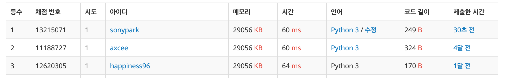

2019년 5월 19일

# 백준 5176 - 대회 자리 {docsify-ignore-all}

> 출처: https://www.acmicpc.net/problem/5176

## 문제
이번 ACM-ICPC 대회의 자리는 참가자들이 직접 정한다. 참가자들은 예비 소집일에 자신이 원하는 자리를 미리 정해놓았고, 대회 당일에 어제 적어놓은 자리에 앉으면 된다. 여러명이 같은 자리를 적어논 경우에는, 먼저 도착한 사람이 그 자리에 앉게되고, 앉지 못한 사람은 대회에 참가할 수 없다.

각 사람이 선호하는 자리가 주어졌을 때, 대회에 참가하지 못하는 사람의 수를 구하는 프로그램을 작성하시오.

#### 입력
첫째 줄에 테스트 케이스의 개수 K가 주어진다. 각 테스트 케이스는 다음과 같이 구성되어 있다.

첫째 줄에 참가자의 수 P와 자리의 수 M이 주어진다. (1 ≤ P, M ≤ 500) 다음 P개 줄에는 각 참가자가 원하는 자리가 주어진다. 자리는 1번부터 M번까지 있다. 입력으로 주어지는 순서는 참가자가 도착하는 순서이다.

#### 출력
각 테스트 케이스에 대해서, 대회에 참가하지 못하는 사람의 수를 출력한다.

#### 예제 입력

```python
3
4 1
1
1
1
1
4 4
1
2
3
4
4 4
1
4
1
4
```


#### 예제 출력

```python
3
0
2
```

## 내 풀이 : set 이용

```python
import sys
t = int(input())

for _ in range(t):
    s = set()
    people, seat = map(int, sys.stdin.readline().split())
    for _ in range(people):
        seat_number = int(sys.stdin.readline())
        s.add(seat_number)
    print(people - len(s))
```


## 느낀점

- 중복 제거하는 문제에서 파이썬 내장 함수인 `set` 을 잘 활용하자. 매우 좋다.
- 이번 문제에서 파이썬 문제풀이 랭킹 1등을 했다. 두 번째 1등인데 top3에 오를 때마다 기분이 좋다 ㅎㅎ


