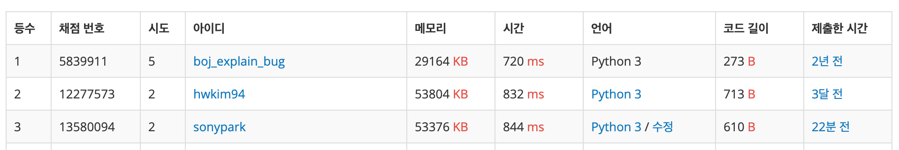

2019년 6월 23일

# 백준 1915 - 가장 큰 정사각형 (DP) {docsify-ignore-all}

> 출처: https://www.acmicpc.net/problem/1915

## 문제

n×m의 0, 1로 된 배열이 있다. 이 배열에서 1로 된 가장 큰 정사각형의 크기를 구하는 프로그램을 작성하시오.

0|	1|	0|	0|	
---|---|---|---|
0|	1|	1|	1|
1|	1|	1|	0|
0|	0|	1|	0|

위와 같은 예제에서는 가운데의 2×2 배열이 가장 큰 정사각형이다. 

#### 입력

첫째 줄에 n, m(1 ≤ n, m ≤ 1,000)이 주어진다. 다음 n개의 줄에는 m개의 숫자로 배열이 주어진다.

#### 출력

첫째 줄에 가장 큰 정사각형의 넓이를 출력한다.

#### 예제 입력1

```
4 4
0100
0111
1110
0010
```

#### 예제 출력1

```
4
```

## 접근 방법

- N x M 배열(`d`)에 문제에서 주어진 값을 입력받는다.

- 첫 번째 행(i=0)과 첫 번째 열(j=0)의 값은 그대로 둔다.

- `(i,j)` 위치의 값이 1인 경우 `(i-1, j)`, `(i-1, j-1)`, `(i, j-1)` 행렬의 최소값에 1을 더한다.

0|	1|		
---|---|
0|	1|

- `(i,j)` 위치의 값이 0인 경우 정사각형을 만들 수 없으므로 skip 한다.

0|	1|		
---|---|
0|	0|

- 모든 행렬 위치에 대해 위 과정을 반복하면 각 원소의 위치에서 가장 큰 정사각형을 만들 수 있는 길이를 얻을 수 있다.

- 얻은 결과값 중 최대값의 제곱을 해주면 가장 큰 정사각형의 넓이가 된다.

## 내 풀이

```python
import sys

n, m = map(int, sys.stdin.readline().split())

d = [[0] * m for _ in range(n)]

for i in range(n):
    a = list(map(int,sys.stdin.readline().rstrip()))
    for j in range(len(a)):
        d[i][j] = a[j]

def biggestSquare(d):
    for i in range(1, n):
        for j in range(1, m):
            if d[i][j] == 1:
                d[i][j] = min(d[i-1][j], d[i-1][j-1], d[i][j-1]) + 1
            elif d[i][j] == 0: continue

    MAX_COUNT = 0
    for k in range(len(d)):
        M = max(d[k])
        if M > MAX_COUNT:
            MAX_COUNT = M
    return MAX_COUNT **2

print(biggestSquare(d))
```

## 배운점

- 첫 번째 행과 열은 따로 계산할 필요 없이 그대로 넣어주면된다.

- 가장 큰 정사각형의 길이는 for 문을 한 번만 돌며 계산할 수 있다.
    - 프로그래머스 풀이에서는 이중 포문으로 풀었다..

## 느낀점

- 얼마 전에 프로그래머스 풀었던 풀이보다 더 효율적으로 풀어서 기분이 좋다.

- 이 문제 파이썬 랭킹도 3등인걸 보면 시간 복잡도도 꽤 괜찮은 것 같다.


