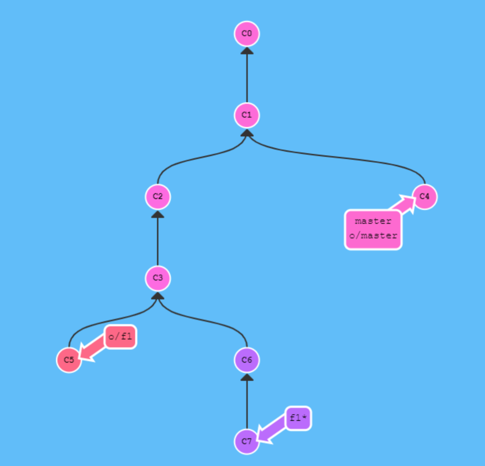

2019년 5월 24일

# Git 시험

---

> 2019 코드스쿼드 웹 백엔드 과정 Git 시험

## (1) 아래와 같은 상황에서 f1 branch를 master에 merge하기 위한 명령어들을 기술하세요.



```bash
git rebase
git checkout master
git merge f1
```

- 충돌 방지를 위해 `rebase` 후 `merge` 한다.

## (2) Git에서 다음 파일은 어떤 상태를 의미하는지 stage, HEAD, 디렉토리의 관점에서 설명하세요.

- `Untracked` : 추적하지 않는 새로운 파일이 생성된 상태 (WD에만 있다.)

- `New` : 추적하는 새로운 파일이 생성된 상태 - untracked 파일을 add 한 상태

- `Modified` : 파일을 수정한 상태 - untracked 파일을 add 한 이후에 수정한 상태

- `Staged` : 스테이지에 올라간 상태. 즉 파일을 add 한 상태

- `Unmodified`  : add한 파일을 커밋한 상태 


- git status (Clean) : 커밋할 사항 없음, 작업 폴더 깨끗함. 

    - 작업 디렉토리(WD), 스테이지(index of stage), 로컬 디렉토리(LD)가 변경사항 없이 모두 같은 깨끗한 상태

- 작업 디렉토리(WD)의 모든 파일은 **추적하는 파일(Tracked)**, **추적하지 않는 파일(Untracted)** 두 가지 상태로 나뉜다.
  - add 하기 전의 파일은 모두 추적하기 전 파일이다. (untracted 상태)
  - add 한 파일은 추적 파일이 된다. (tracked 상태)

- `git add` 명령어를 사용하는 두 가지 경우
  - **새로운(untracked) 파일**을 **추적(track)**할 때 - `New`
  - **수정한(modified) 파일**을 **staged 상태로** 만들 때 - `Staged`


## (3) Git의 Object 종류에 대해 나열하고 설명하시오. 이중 가장 중요한 객체는 무엇인가? 이유는?

- `Tag` : `Tag`는 그 이름이 뜻하는 `commit`을 가리킨다. `Tree`가 아닌 `commit`을 가리킨다. `Tag`에는 태그를 단 사용자와 태그 메시지, 커밋 정보가 담겨있다.

- `Commit` : 커밋 메시지를 담고 있다. 포인터로 Tree를 가리키고 있다.

- `Tree` : 포인터로 파일 이름과 파일 내용을 가리키고 있다. 다른 Tree를 가리키기도 한다.

- `Blob` : 실제 데이터를 가지고 있다. (source code, images etc)

> **비유**하자면, `Tree`는 **디렉토리**이고 `Blob`은 **파일**이다.

- 이 중에서 가장 중요한 객체는 `Commit` 이다. `git`은 `commit`을 관리하기 때문이다.

## (4) 고양이는 같은 내용의 4KB짜리 파일을 10개 만들어서 여러 디렉토리에 복사한 후 Add –commit 하였다.이때 Git 저장소에는 blob 오브젝트가 몇 개 생기는가?

- **하나 생긴다.**

- Tree 객체가 여러개 생긴다.

- 각각의 Tree 객체는 각각의 디렉토리의 이름과 파일 내용을 가리키고 있다.
  - 서로 다른 디렉토리가 10개라면 10개의 트리가 생긴다.
  - 디렉토리 안에는 같은 내용의 파일이 들어있기 때문에 하나의 blob 객체를 가리킨다.

## (5) 문어는 같은 내용의 4KB 파일을 서로 다른 브랜치 10개에 중복저장 하였다. 이때 Git 저장소에는 blob 오브젝트가 몇 개 생기는가?

- **하나 생긴다.**

- git은 같은 내용의 파일을 중복 저장하지 않는다.

- 하나의 blob 객체를 만들고 여러 브렌치가 하나의 blob을 참조한다.

## (6) 브랜치를 새로 만들면 전체 Git 저장소의 용량은 얼마나 증가할까?

- 브랜치는 단순히 참조변수 이기 때문에 저장소의 용량은 거의 증가하지 않을 것이다.

- 40 바이트 정도 (pointer: checksum 크기가 40바이트)

## (7) Rebase 와 merge의 차이에 대해 기술하시오

- 두 명령어의 공통점은 두 브랜치를 하나로 합치는 것이다.

- 차이점은 `merge`는 이전 커밋 컨텍스트를 유지하며 병합하는 것이고 `rebase`는 이전 커밋 컨텍스트를 변경하며 병합한다.

  - `merge`의 경우 커밋 히스토리가 시간 순으로 그대로 남아있다.
  - 하지만 `rebase`의 경우 기존 커밋을 지우고 새로운 커밋을 생성하기 때문에 커밋 히스토리가 변경된다.

- `rebase`를 하면 새로운 커밋을 만들며 다른 브렌치의 뒤로 이동한다.

  - 예를들어, `bugFix` 브랜치에서 `master` 브랜치로 `rebase`를 하면 `bugFix` 브랜치의 기존 커밋은 사라지고 새로운 커밋이 생기며 `master` 브랜치의 뒤로 이동하며 합쳐진다.

- `rebase`는 브랜치의 변경사항을 순서대로 다른 브랜치에 적용하면서 합친다.

- `merge`는 두 브랜치의 최종 결과만을 가지고 합니다.

## (8) Rebase와 merge 중 충돌 처리가 쉬운 쪽은 어느 쪽인가? 이유는?

- `merge`가 충돌처리가 더 쉽다.
  - 한 번만 충돌 해결해주면 된다.

- `rebase`의 경우 충돌이 발생하면 기존 커밋 순서대로 하나씩 충돌 처리를 해줘야한다.
  - 여러번 충돌 해결해야한다.

## (9) Git stash 명령에 대해 기술하시오

- A라는 브랜치에서 작업을 하다가 B브랜치로 체크아웃 해야할 경우 `add, commit`을 해주고 체크아웃 해야한다.

- 그런데 일일이 `add, commit`을 해줄 시간이 없거나 귀찮을 때가 있다.

- 그럴 경우 `git stash`를 해주면 된다.

- `git stash` 명령어를 사용하면 stash라는 가상공간에 임시로 작업하던 파일을 올려놓는다.

- 이로써 작업디렉토리(WD)가 깨끗해지게 되고 B 브랜치로 체크아웃하여 작업을 진행 할 수 있다.

- B 브랜치에서 작업을 완료한 후에 다시 A 브랜치로 돌아와서 작업할 경우

- A브랜치로 체크아웃 한 후에 `git stash apply` 명령어를 적용하면 `stash`에 임시 저장한 파일들을 다시 불러온다.

- `stash` 명령어를 사용하면 작업 디렉토리(WD)에서 수정한 파일만 저장한다. 

- `stash`는 `Modified` 이면서 `Tracked` 상태인 파일과 `Staging Area`에 있는 파일들을 보관해두는 장소다.

- 아직 끝나지 않은 수정사항을 `stash`에 임시 저장한 후에 나중에 다시 적용(apply)할 수 있다.

## (10) Hared reset, soft reset, mixed reset 의 차이점에 대해 설명하시오

모드명 | HEAD의 위치 | 인덱스| 작업 디텍토리
--------- | --------- | ----------| ----------------
soft| 변경함| 변경 안 함| 변경 안 함
mixed| 변경함| 변경함| 변경 안 함
hard| 변경함| 변경함| 변경함

- `soft` : 커밋만 되돌리고 싶을 때

- `mixed` : 변경한 인덱스 상태를 원래 상태로 되돌리고 싶을 때

- `hard` : 최근 커밋을 완전히 버리고 이전 상태로 되돌리고 싶을 때