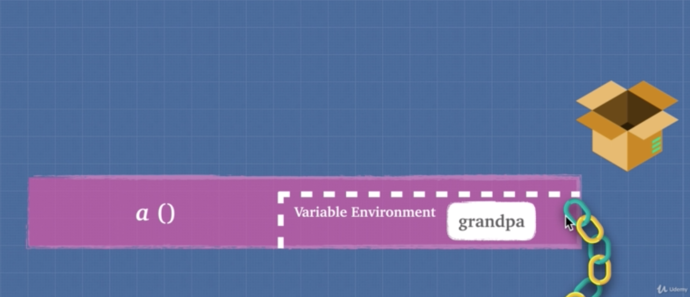
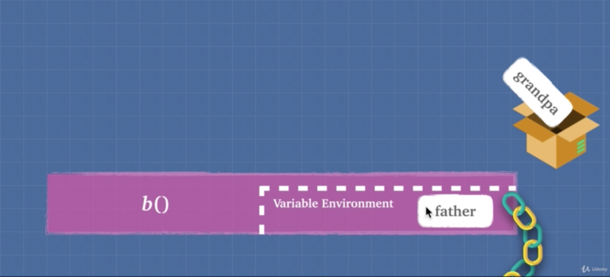
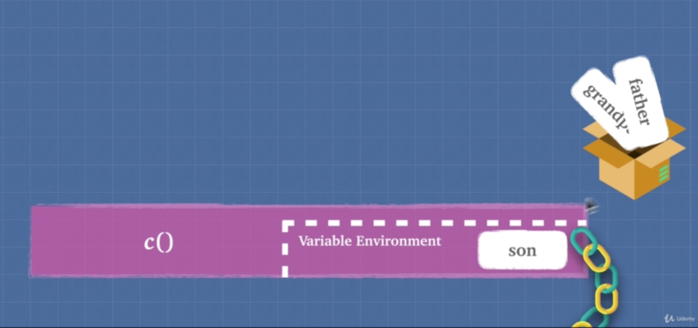

2019년 4월 28일

# Javascript 클로저2

> 아래 내용은 대부분 [Udemy: Advanced JavaScript Concepts by Andrei Neagoie](<https://www.udemy.com/advanced-javascript-concepts/>)을 참고해서 정리했습니다. 

 ## Closures

- 클로저(closures)는 자바스크립트의 일급 함수와 lexical scope라는 두 가지 특성을 기반으로 동작한다.


- Closures allow a function to access variables from an enclosing scope or environment even after it leaves the scope which it was declared

```javascript
function a() {
    const grandFather = 'grandFather';
    return function b() {
        const father = 'father';
        return function c() {
            const son = 'son';
            return `${grandFather} > ${father} > ${son}`
        }
    }
}
console.log(a()()()); // grandFather > father > son
```

- 위 예제에서 함수 a,b는 함수를 리턴하고 있으므로 HOF(Higher Order Function)이고 c는 일반 함수이다.

- 함수 a에 의해 함수 c가 실행되었을 때 결과값을 보자

- 함수 c의 지역 변수인 `son` 뿐만 아니라 함수 a,b의 지역 변수인 `grandFather` 와 `father` 도 출력되고 있다.

- 일반적으로 함수가 실행되면 call stack에 해당 함수의 실행 컨텍스트(Execution context)가 쌓이고 함수가 종료되면 해당 함수의 실행 컨텍스트(Execution context)는 사라진다.  이 때 실행 컨텍스트(Execution context) 안에 있는 변수 유효범위(variable environment)도 같이 사라진다. 따라서 해당 함수의 지역 변수에는 접근 할 수 없게된다.

- 하지만 위의 경우는 그렇지 않다.

- 그 이유는 바로 클로저(closures) 때문이다.

- 아래 그림을 보자



- a 함수가 실행 되면 call stack에 위와 같이 a 함수의 실행 컨텍스트가 쌓인다. a함수의 실행 컨텍스트 안에는 variable environment가 있고 그 안에 grandpa라는 변수가 있다.


- 함수가 실행되면 a 함수의 실행 컨텍스트는 call stack에서 사라지고 grandpa는 클로저(closures)라는 박스 안으로 들어간다. 클로저는 메모리 힙(memory heap)에 있는 특별한 공간이다.
- 가비지 컬렉터(garbage collector)는 클로저(closures)를 특별한 공간으로 여기고 제거하지 않는다.



- b 함수가 실행되면 실행 컨텍스트가 call stack에 쌓이고
- variable environment 안에 father라는 변수가 생성된다.


- b 함수가 종료되면 변수 father는 클로저(closures)에 저장된다.



- c 함수가 실행되면 실행 컨텍스트가 call stack에 쌓인다.

- c 함수의 리턴값으로 변수 `son`, `grnadpa`,`father` 가 필요하다.

- `son` 은 c 함수의 variable environment 안에 있으므로 접근 가능하다.

- 하지만 `grnadpa`,`father` 는 c 함수의 variable environment에 없기 때문에 scope chain을 통해 접근을 시도한다.

- 이 때 전역 변수 환경(global environment)가 아닌 클로저(closures)에 `grnadpa`,`father` 가 있는지 확인한다.

- 클로저는 자바스크립트 언어의 특징이다.

- 클로저를 이용하면 외부 함수가 종료된 이후에도 내부 함수에서 외부 함수 변수에 접근할 수 있다.

- 가비지 컬렉터(garbage collector)는 클로저(closures)를 특별한 공간으로 여기고 제거하지 않는다. 가비지 컬렉터는 클로저에 담긴 변수는 내부함수에서 참조하고 있는 변수라고 여기기 때문이다. 만약 외부함수의 변수일지라도 내부 함수에서 참조하는 변수가 아니면 클로저에 담기지 않으며 가비지 컬렉터에 의해 제거된다.

```javascript
function a() {
    const grandFather = 'grandFather';
    return function b() {
        const father = 'father';
        const random = 123183521;
        return function c() {
            const son = 'son';
            return `${grandFather} > ${father} > ${son}`
        }
    }
}
console.log(a()()()); // grandFather > father > son
```

- 위 예제에서 b 함수 내에 `random`  변수가 있다.
- `random` 변수는 내부 함수(c)에서 참조하지 않는 변수이다.
- 따라서 `random` 변수는 b 함수 종료 시 클로저에 저장되지 않고 가비지 컬렉터에 의해 제거된다.


-  클로저(closure)는 자바스크립트의 다음 두 가지 특성에 의해 동작한다.


- 1. 일급 함수(First citizen function)이기 때문에 함수를 리턴값으로 전달할 수 있다.
  2. lexical scope를 따르기 때문에 함수가 선언된 부분에 의해 scope chain이 정해진다.

- 클로저라는 특성을 이용해 내부 함수에서 외부함수의 지역 변수를 자신의 지역 변수처럼 사용할 수 있다.

- 내부함수의 클로저에 내부함수가 참조하는 외부함수의 지역변수가 담겨있기 때문에 자유롭게 접근하여 사용할 수 있다.

```javascript
  function boo(string) {
    return function(name){
      return function(name2){
        console.log(`${string} ${name} ${name2}`)
      }
    }
  }
```

- 위 함수는 arrow 함수를 이용해 아래와 같이 간단하게 표현할 수 있다.

```javascript
const boo = (greeting) => (name) => (name2) =>
console.log(`${greeting} ${name} ${name2}`)
```

```javascript
boo('hi')('sony')('park') // hi sony park
```

- 클로저의 막강한 힘은 아래와 같은 경우에 발휘된다.

```javascript
const booGreeting = boo('hi');
// 5 years later
const booGreetingName = booGreeting('sony');
// 10 years later
const booGreetingName2 = booGreetingName('park');
console.log(booGreetingName2); // hi sony park
```

- boo를 한 번 실행하면 `hi`라는 변수가 boo 내부 함수의 클로저에 저장된다.

- 이 말은 아무리 시간이 지나도 내부함수에서 언제든지 자신이 참조하고 있는 외부함수 변수에 접근 할 수 있음을 의미한다.

- 위와 같은 이유 때문에 클로저는 자바스크립트 프로그래밍에서 많이 활용되고 그 만큼 중요하다.

### Exercise Closures 1

```javascript
function callMeMaybe() {
  const callMe = 'Hi! I am Sony';
  setTimeout(function () {
      console.log(callMe);
  }, 4000);
}
callMeMaybe(); // Hi! I am Sony
```

- 위 예제에서 callMeMaybe함수 안에 setTimeout함수가 있으며  setTimeout함수의 콜백 함수로 익명 함수가 있다. 

- 익명 함수는 callMeMaybe함수의 내부함수이기 때문에 클로저를 통해 외부함수 callMeMaybe의 지역 변수 callMe에 접근할 수 있다.

- 자바스크립트 엔진 내에서 위 함수의 동작 순서는 다음과 같다. (이해하기 쉽게 설명하기 위한 순서이므로 실제 동작순서와는 다르다.)

- callMeMaybe함수가 실행된다.
- call stack에 callMeMaybe함수의 실행 컨텍스트가 쌓인다.
- callMeMaybe함수의 콜백함수인 setTimeout 함수가 실행된다.
- setTimeout 함수의 콜백 함수(익명함수)가 Web API로 보내진다.
- callMeMaybe함수가 종료되며 실행 컨텍스트가 call stack에서 사라진다.
- setTimeout 함수의 콜백 함수(익명함수)가 Web API에서 4초간 머무른다.
- 시간이 완료되면 callback Queue로 넘어간다.
- call stack이 비어 있으면 setTimeout 함수의 콜백 함수(익명함수)가 call stack으로 올라간다.
- setTimeout 함수의 콜백 함수(익명함수)가 실행된다.
  - console.log(callMe); // Hi! I am Sony

```javascript
function callMeMaybe() {
    setTimeout(function () {
        console.log(callMe);
    }, 4000);
    const callMe = 'Hi! I am Sony';
}
callMeMaybe(); // Hi! I am Sony
```

- callMe 변수의 위치를 setTimeout함수 밑으로 변경해도 결과는 동일하다.

- callMe 변수는 const로 선언했기 때문에 호이스팅이 일어나지 않는다.

- 하지만 호이스팅과 관계 없이 setTimeout함수의 콜백 함수에서 callMe 변수에 접근할 수 있다.

- 그 이유는 위의 동작 순서를 보면 알 수 있다.

- setTimeout함수의 콜백 함수 보다 callMeMaybe함수가 먼저 실행 후 종료된다.

- 따라서 callMeMaybe함수의 지역 변수인 callMe변수는 이미 선언되어 클로저에 저장된 상태이다.

- 그러므로 setTimeout함수의 콜백 함수에서 callMe 변수에 접근할 수 있다.

## Closures and Memory

- 클로저를 사용하면 다음 두 가지 효과를 기대할 수 있다.

1. **Memory Efficient**
2. **Encapsulation**

### Memory Efficient

- 클로저를 이용하면 메모리를 효율적으로 이용할 수 있다.

- 아래 예제를 보자

```javascript
function heavyDuty(index) {
    const bigArray = new Array(7000).fill('🙂');
    console.log('bigArray created!');
    return bigArray[index]
}
heavyDuty(600); // bigArray created! 🙂
heavyDuty(700); // bigArray created! 🙂
heavyDuty(800); // bigArray created! 🙂
```

- 위 함수는 대용량의 데이터를 담는 Array를 생성하고 특정 인덱스의 값을 반환하는 함수이다.
- 이 함수는 호출될 때마다 bigArray를 생성한다.
- 함수가 종료되면 가비지 컬렉터에 의해 메모리에서 제거된다.
- 불필요한 로직을 반복함으로 메모리 효율성이 낮다.

```javascript
// Closures
function heavyDutyWithClosures() {
    const bigArray = new Array(7000).fill('🙂');
    console.log('bigArray created and restored in Closures!');
    return function (index) {
        return bigArray[index]
    }
}
const getHeavyDuty = heavyDutyWithClosures(); // bigArray created and restored in Closures!
getHeavyDuty(600); // 🙂
getHeavyDuty(700); // 🙂
getHeavyDuty(800); // 🙂
```

- 위 예제는 같은 로직을 클로저를 이용하여 구현했다.
- heavyDutyWithClosures는 한 번만 호출되고 종료된다.
- bigArray도 한 번만 생성되고 getHeavyDuty 함수의 클로저에 저장된다.
- getHeavyDuty함수는 클로저에 저장된 bigArray를 통해 원하는 index에 접근할 수 있다.
- 이전 예제와 비교했을 때 bigArray를 한 번만 생성하고 클로저에 저장하므로 메모리 효율성이 높아졌다.

## Closures and Encapsulation

- Encapsulation: 사용자에게 보여질 필요가 없거나 사용자가 접근해서는 안되는 속성(변수 or 함수)을 캡슐 안에 감춰두는 것을 말한다.

```javascript
// Encapsulation
const makeNuclearButton = () =>{
    let timeWithoutDestruction = 0;
    const passTime = () => timeWithoutDestruction++;
    const totalPeaceTime = () => timeWithoutDestruction;
    const launch = () => {
        timeWithoutDestruction = -1;
        return '💥';
    };
    setInterval(passTime, 1000);
    return{
        'totalPeaceTime': totalPeaceTime
    }
};

const ohno = makeNuclearButton();
ohno.totalPeaceTime(); // 폭탄이 터지지 않고 경과한 시간 출력(1..2..3)
ohno.launch(); // ohno.launch is not a function
```

- 위 예제에서  launch() 를 호출하면 폭탄이 터지는 makeNuclearButton 함수가 선언되어있다.
- launch 함수는 폭탄이 터지는 위험한 버튼이기 때문에 사용자가 접근하지 못하게 하고 싶다.
- 이 때 클로저를 통해 캡슐화(Encapsulation)하여 사용자가 launch 함수에 접근하지 못 하도록 할 수 있다.

## Exercise Closures 2

- 클로저를 이용해 초기화 함수를 한 번만 호출되도록 해보자.

```javascript
let background;
function intialize(){
  background = '⛰';
  console.log('background has been set!')
}
intialize(); // background has been set!
intialize(); // background has been set!
intialize(); // background has been set!
```

- 위 예제는 배경화면을 초기화 하는 함수이다.
- 초기화는 처음 한 번만 진행되면 된다.
- 그런데 위 예제에서는 intialize() 가 호출 될 때마다 초기화가 진행된다.
- 클로저를 이용해 다음과 같이 바꿔보자.

```javascript
let background;
function intialize() {
  let called = 0;
  return function () {
      if(called >0){
          return;
      }
      else{
          background = '⛰';
          called++;
          console.log('background has been set!')
      }
  }
}
const startOnce = intialize();
startOnce(); // View has been set!
startOnce();
startOnce();
```

- 클로저(closures)를 이용하면 intialize가 단 한 번만 호출되게 할 수 있다.

## Exercise Closures 2

- 다음은 예제는 면접에서 매우 자주 물어보는 질문이다.

- `for loop` 안의 `setTimeout`과 변수 `i`

```javascript
const arr = [1,2,3,4];
for(var i=0; i< arr.length; i++){
  setTimeout(function () {
      console.log(i)
  }, 1000)
}
// output
// 4
// 4
// 4
// 4
```

- 위 예제를 실행하면 결과값은 4가 4번 출력된다.

- 그 이유는 setTimeout의 콜백 함수가 `전역 변수 i`를 참조하고 있기 때문이다.

- setTimeout의 콜백 함수가 Web API와 callback Queue를 거쳐 call stack에서 실행될 때는 for 문이 끝나고 `i`가 4가 된 시점이다.

- 따라서 4가 4번 출력된다.

- 하지만 원하는 결과값은 0,1,2,3 이 출력되는 것이라고 해보자.

- 원하는 결과값을 얻기 위해 다음 두 가지 방법을 이용할 수 있다. (이 두 가지 방법만 있는 건 아니다.)

- 1. **let 사용**

```javascript
// let 사용 -> make 'i' as a block scope variable
const arr = [1,2,3,4];
for(let i=0; i< arr.length; i++){
    setTimeout(function () {
        console.log(i)
    }, 1000)
}
// output
// 0
// 1
// 2
// 3
```

- 변수 i의 keyword를 `var`대신 `let` 로 바꿔주는 것만으로 간단히 해결된다.
- 그 이유는 `let` keyword는  블록 스코프를 따르기 때문에 변수 i를 for문 블록 안의 지역변수로 만들어준다.
- 따라서 setTimeout의 콜백 함수가 참조하는 변수 i는 for 문 블록 스코프 안에 있는 i를 참조하게 된다.
- 즉, for 문 안에서 setTimeout이 실행 될 때마다 `setTimeout의 콜백 함수에서 참조하는  변수 i`는`실행 시점의 for 문 블록 안의 i` 가 된다.

2. **즉시 실행 함수를 통한 클로저 생성**

```javascript
// 즉시 실행함수를 통해 클로저(closures) 생성
const arr = [1,2,3,4];
for(var i=0; i< arr.length; i++) {
    (function (closureI) {
        setTimeout(function () {
            console.log(closureI)
        }, 1000)
    })(i)
}
// output
// 0
// 1
// 2
// 3
```

- setTimeout을 즉시 실행 함수로 감쌌다.
- 이렇게 되면 즉시 실행함수가 외부함수가 되고 setTimeout은 내부함수가 된다.
- 이 때 즉시 실행 함수에서 for 문의 변수 i를 인자로 받으면 `변수 i(closureI)`는 즉시 실행 함수의 지역 변수가 된다.
- setTimeout(내부함수)는 스코프 체인에 의해  즉시 실행 함수(외부함수)의 지역 변수인 `closureI` 를 참조할 수 있다.
- 그러므로 즉시 실행 함수가 실행될 때 setTimeout 함수의 콜백함수는 클로저를 생성하여 해당 시점의 `변수i(closureI`)를 저장한다.
- 이를 통해 원하는 결과값을 얻을 수 있다.

## 정리


- Closures allow a function to access variables from an enclosing scope or environment even after it leaves the scope which it was declared because all that matters in Javascript is where the function was written


### Reference

- [Udemy: Advanced JavaScript Concepts by Andrei Neagoie](<https://www.udemy.com/advanced-javascript-concepts/>)
- [MDN](https://developer.mozilla.org/en-US/docs/Web/JavaScript/Closures)
- [javascripttutorial](http://www.javascripttutorial.net/javascript-prototype/)
- [인사이드 자바스크립트](http://www.kyobobook.co.kr/product/detailViewKor.laf?mallGb=KOR&ejkGb=KOR&barcode=9788968480652)