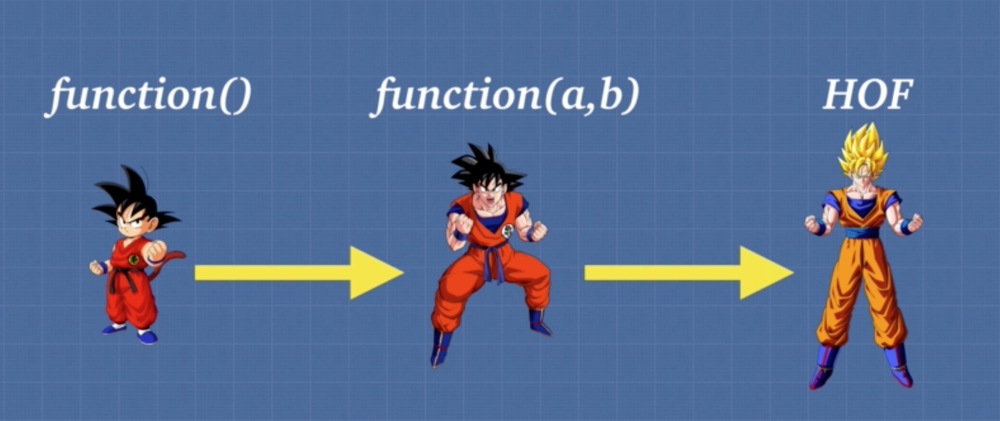

2019년 4월 28일

# Higher Order Function

---

> 아래 내용은 대부분 [Udemy: Advanced JavaScript Concepts by Andrei Neagoie](<https://www.udemy.com/advanced-javascript-concepts/>)을 참고해서 정리했습니다.

- HOF(Higher Order Function)은 **함수를 인자값으로 받을 수 있는 함수**를 말한다.

> Functions which receive “funargs” are called *higher-order functions*

- **자바스크립트에서 함수**는 **일급 객체(first-class-object)** 이므로 **HOF**으로 쓰일 수 있다.

- 아래 그림처럼 **HOF**는 막강하다. 



- 그렇다면 **Higher Order Function**은 왜 유용할까?

- 위 세 가지 함수를 비교해보자.

## 1. function(): 파라미터가 없는 함수

```javascript
function letSonyLogin(){
     const array =[];
     for (let i=0; i < 1000000; i++){
         array.push(i)
     }
     return 'Access Granted to Sony'
}
console.log(letSonyLogin()); // Access Granted to Sony
```

- 위 예제와 같이 로그인 함수를 만들었다고 가정하자.
- Sony라는 유저의 로그인 함수를 만들었다.
- 다른 유저의 로그인 함수를 만드려면 동일한 함수를 이름만 바꿔 다시 만들어야 한다.

```javascript
function letSonyLogin(){
     const array =[];
     for (let i=0; i < 1000000; i++){
         array.push(i)
     }
     return 'Access Granted to Sony'
}
console.log(letSonyLogin()); // Access Granted to Sony

function letParkLogin(){
     const array =[];
     for (let i=0; i < 1000000; i++){
         array.push(i)
     }
     return 'Access Granted to Park'
}
console.log(letParkLogin()); // Access Granted to Park
```

- 이처럼 불필요한 중복이 발생한다.
- 유저가 100만명이라면 함수 100만개를 만들어야한다.
- 매우 비효율적이다.

## 2. function(a,b): 파라미터가 있는 함수

```javascript
function letUserLogin(user) { // ++ We now tell WHAT DATA TO USE
       const array = [];
       for (let i = 0; i < 1000000; i++) {
           array.push(i)
       }
       return 'Access Granted to ' + user
}
console.log(letUserLogin('Sony')); // Access Granted to Sony
```

       

 - 유저 로그인 함수를 만들고 파라미터를 통해 유저의 이름을 받을 수 있다.

 - 이전보다 flexiblity가 높아졌다.

```javascript
const giveAccessTo =(name) =>
    'Access Granted to ' + name;
 
function letUserLogin(user) { // ++ We now tell WHAT DATA TO USE
     const array = [];
     for (let i = 0; i < 1000000; i++) {
         array.push(i)
     }
     return giveAccessTo(user);
 }
console.log(letUserLogin('Sony')); // Access Granted to Sony
```

- `giveAccessTo`라는 함수를 이용해 좀 더 깔끔해졌다.
- 그런데 만약 로그인하는 유저의 종류에 따라 다른 처리를 해야한다면 어떻게 할까?

```javascript
const giveAccessTo =(name) =>
'Access Granted to ' + name;

function letUserLogin(user) { // ++ We now tell WHAT DATA TO USE
     const array = [];
     for (let i = 0; i < 1000000; i++) {
         array.push(i)
     }
     return giveAccessTo(user);
}

function letAdminLogin(admin) { // admin login
     const array = [];
     for (let i = 0; i < 5000000; i++){ //strong permission process
         array.push(i)
     }
     return giveAccessTo(admin);
}
```

- 예를 들어, 관리자 로그인은 일반 유저 로그인보다 더 많은 검증 단계가 필요 할 수 있다.
- 관리자 뿐만 아니라, Guest 로그인, Manager 로그인 등 다양한 로그인 기능이 필요할 수 있다.
- 이 때마다 새로운 함수를 만들게 되면 중복된 코드가 많아지고  flexiblity 가  낮아진다.

## 3. HOF(Higher Order Function)

- HOF를 이용해서 보다 유연한(flexible)한 함수를 만들어보자.

```javascript
const giveAccessTo = (name) => 'Access Granted to ' + name;

function authenticate(verify) {
     const array = [];
     for (let i = 0; i < verify; i++) {
          array.push(i)
    }
     return true;
}

function letPerson(person, fn) { // ++ tell WHAT DATA TO USE + function
     if(person.level === 'admin'){
         fn(500000);
     } else if (person.level ==='user'){
         fn(100000);
     }
     return giveAccessTo(person.name)
}
console.log(letPerson({level: 'admin', name: 'Sony'}, authenticate)); // Access Granted to Sony
```

- `letPerson`이라는 HOF를 만들었다.

- `letPerson`은 함수를 인자로 받는다. 따라서 어떤 데이터를 사용할지(what data to use)와 어떤 행동을 할지(what function to use)를 정의할 수 있다.

- **HOF**를 통해 이 전보다 유연한(flexible)한 함수가 되었다.

- 이 말은 `letPerson`의 인자값으로 다양한 데이터 또는 함수가 들어가 새로운 로직을 구현을 수 있음을 의미한다.

```javascript
const giveAccessTo =(name) =>
   'Access Granted to ' + name;

function authenticate(person) {
       const array = [];
       for (let i = 0; i < person.verify; i++) {
           array.push(i)
       }
       return giveAccessTo(person.name);
}

function sing(person) {
   return 'lalala my name is ' + person.name;
}

function letPerson(person, fn) { // ++ tell WHAT DATA TO USE + function
       if(person.level === 'admin'){
           return fn(person);
       } else if (person.level ==='user'){
           return fn(person);
       }
}
console.log(letPerson({level: 'admin', name: 'Sony', verity: '500000'}, authenticate)); // Access Granted to Sony
console.log(letPerson({level: 'admin', name: 'Sony', verity: '500000'}, sing)); // lalala my name is Sony
```

- 위와 같이 `letPerson`의 인자값으로 들어가는 함수에 따라 서로 다른 로직이 진행되게 할 수 있다.

 

### 정리

- **function()**
    
    - *로그인 함수를 파라미터가 없는 일반 함수로 구현했을 때*
    
    -  `letSonyLogin`와 같이 하나의 유저만 관리하는 매우 한정적인 기능만 했다.

- **function(a,b)**
    
    -  *파라미터를 갖는 함수로 구현했을 때*  
    
    - `letUserLogin` 와 같이 여러 유저의 로그인을 관리하는 기능으로 발전했다. 
    
    - 즉, 필요한 데이터(ex.유저 이름)를 동적으로 할당할 수 있게 되었다. 
    
    - 하지만 유저마다 서로 다른 로직을 진행 할 수는 없었다.

- **HOF(Higher Order Function)**
    
    - *HOF로 구현했을 때* 
    
    - 인자값으로 함수를 받아 유저의 특징에 따라 서로 다른 기능을 하는 로직을 구현할 수 있게 되었다. 
    
    - 하나의 함수로 여러가지의 일을 함으로써 보다 유연한(flexible)한 코드가 되었다.

### HOF를 이용해서 곱하기 함수 만들기

- HOF를 이용하면 곱셈 함수도 효율적으로 만들 수 있다.

```javascript
const multiplyBy = function(num1){
      return function (num2) {
          return num1 * num2
      }
};

const multiplyByTwo = multiplyBy(2);
const multiplyByFive = multiplyBy(5);

multiplyByTwo(4); // 8
multiplyByTwo(10); // 20
multiplyByFive(6); // 30
```

- arrow 함수를 이용하면 좀 더 직관적이고 간단하게 표현 가능하다.

```javascript
const multiplyBy = (num1) => (num2) => num1 * num2;
```
____
   
### Reference

- [Udemy: Advanced JavaScript Concepts by Andrei Neagoie](https://www.udemy.com/advanced-javascript-concepts)