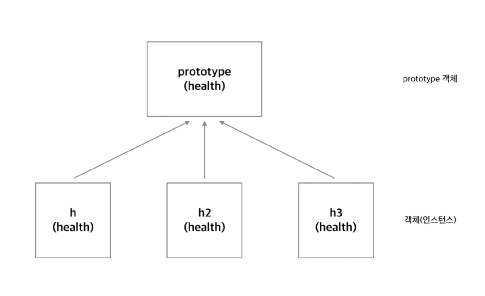

2019년 4월 28일

# 자바스크립트의 객체지향 프로그래밍

___

## 자바스크립트의 객체 지향

  - 자바스크립트는 다른 객체지향 프로그래밍 언어와는 다르다.
  
  - 그래서 혼란스러울 수 있다.
  
  - 자바스크립트는 **프로토타입(prototype) 기반** 프로그래밍 언어이다.
    - **prototype based programming**

## 자바스크립트의 생성자

  > 생성자는 객체를 만드는 역할을 하는 함수이다.

  - 자바스크립트에서는 **함수**를 **호출** 할 때 앞에 **new**를 붙이면 **새로운 객체**를 만든 후 이를 리턴한다.

  - 자바스크립트에서는 **함수로 생성자를 만든다.**

    - 일반적인 객체 지향 언어에서 생성자는 클레스에 소속되어 있다.
    - ex) 자바
      - 자바에서는 클래스 안에 생성자가 있다.
      - 클래스 안의 생성자를 호출하는 것을 통해 객체를 만든다.

  - 자바스크립트에는 클래스가 따로 없다.

    - 생성자가 어디에 소속되어 있지 않고 **함수**를 **호출** 할 때 **new**를 붙이면 **생성자**가 만들어진다. 
    - 그리고 그 **리턴** 값이 **객체**가 된다.

## 생성자의 역할

- **객체**를 **초기화** 한다.

- 이를 통해 **코드**의 **재사용성**이 대폭 높아진다.

```javascript
function Person(name){
    this.name = name;
    this.introduce = function(){
        return 'My name is '+this.name; 
    }   
}
var p1 = new Person('egoing');
document.write(p1.introduce()+"<br />");
 
var p2 = new Person('leezche');
document.write(p2.introduce());
```

> [출처]: 생활코딩 자바스크립트 생성자와 new

- 생성자 내에서 **객체**의 **프로퍼티**를 **정의**한다.
- 이러한 작업을 **초기화**라고 한다.
- **생성자 함수**는 일반함수와 구분하기 위해서 **첫 글자**를 **대문자**로 표시한다.

## this keyword

- **this는 해당 메서드를 출력한 객체를 가리킨다.**

- 일반 함수의 this가 window인 것은 앞에 `window.`이 생략되었기 때문이다.

### 1. 일반 함수에서 this

> 일반함수는 window 객체의 메서드이기 때문에 일반함수에서 this는 window를 가리킨다.

```javascript
function func(){
    if(window === this){
        document.write("window === this");
    }
}
func();  // window === this
```

- func 앞에 `window.`이 생략되어있다.

- func()은 window.func()과 같다.

- **일반 함수는 결국 window의 메서드이다.**

### 2. 객체의 메서드에서 this

> 객체 소속 메서드의 this 는 그 객체를 가리킨다.

```javascript
var o = {
    func : function(){
        if(o === this){
            document.write("o === this");
        }
    }
}
o.func();   // o === this
```

- func() 함수를 호출한 객체는 `o`이기 때문에 this는 `o`를 가리킨다.

### 3. 생성자 함수 안에서 this

> 생성자 함수 안에서 this는 생성자가 만든 객체를 가리킨다.

```javascript
var funcThis = null; 
 
function Func(){
    funcThis = this;
}
 
var o2 = new Func();
if(funcThis === o2){
    console.log('funcThis === o2');
}
// output:
// funcThis === o2
```

- **생성자 함수**는 **빈 객체**를 만든다.

- 이 객체 내에서 **this**는 **새로 만들어진 객체**를 가리킨다.

- 이것은 **매우 중요**하다.

- 생성자가 실행되기 전까지는 객체는 변수에 할당될 수 없기 때문에 **this**가 아니면 객체에 대한 어떠한 작업도 할 수 없기 때문이다. 

```javascript
function Func(){
    console.log(o); // undefined
}
var o = new Func();
```

> [출처]: 생활코딩 자바스크립트 this

- 위 예제와 같이 객체 안에서는 생성자 함수에 의해 할당된 변수에 접근할 수 없다.

- `console.log(o)`가 실행되는 시점은 생성자 함수가 실행되기 전(새로운 객체가 변수 `o`에  할당되기 전)이기 때문에 `o`는 undefined가 뜨게 된다.

### apply, call

- 함수의 메서드인 `apply, call`을 이용하면 **this**의 값을 **제어**할 수 있다.

- **this**는 해당 함수(메서드)가 소속된 **객체**를 가리킨다.

- `apply,call`은 **this**가 원래 소속된 객체가 아닌 다른 객체를 가리키도록 제어할 수 있다.

```javascript
var o = {}
var p = {}
function func(){
    switch(this){
        case o:
            console.log('this: o');
            break;
        case p:
            console.log('this: p');
            break;
        case window:
            console.log('this: window');
            break;          
    }
}
func(); // this: window
func.apply(o); // this: o
func.apply(p); // this: p
```

- 위 예제에서 함수 `func`의 **this**는 `window`를 가리킨다.

- `func.apply(o)`: apply 메서드를 이용해 **this**가 `o`객체를 가리키도록 변경했다.

- `func.apply(p)`: apply 메서드를 이용해 **this**가  ` p`  객체를 가리키도록 변경했다.

## 상속(Inheritance)

- 자바스크립트에서 **상속**을 받기 위한 방법

- `상속 받고 싶은 객체`(**부모**)를 `상속할 객체`(**자식**) **생성자**의 **프로토타입**에 할당한다.

```javascript
function Person(name){
    this.name = name;
}
Person.prototype.name=null;
Person.prototype.introduce = function(){
    return 'My name is '+this.name; 
}
 
function Programmer(name){
    this.name = name;
}
Programmer.prototype = new Person();
 
var p1 = new Programmer('sony');
console.log(p1.introduce()); // My name is sony
```

- 위 예제에서 `Person`은 부모 객체가 되고 `Programmer`는 자식 객체가 된다.
- `Programmer`가 `Person`을 상속 받는 방법은 다음과 같다.
- `Programmer` 라는 생성자를 만든다.
- 이 생성자의 `prototype`에 `Person`의 객체를 할당하면 `Programmer` 객체도 `Person`의 `introduce` 메서드를 사용할 수 있다.

#### 상속을 통한 기능 추가

```javascript
function Person(name){
    this.name = name;
}
Person.prototype.name=null;
Person.prototype.introduce = function(){
    return 'My name is '+this.name; 
}
 
function Programmer(name){
    this.name = name;
}
Programmer.prototype = new Person();
Programmer.prototype.coding = function(){
    return "hello world";
}
 
var p1 = new Programmer('sony');
console.log(p1.introduce()); // My name is sony
console.log(p1.coding()); // hello world
```

- `Programmer`는 `Person`의 기능을 가지면서 `Person`이 가지고 있지 않은 기능인 `coding` 메서드를 갖는다. 

## prototype

- **prototype**은 **객체의 원형**이라고 할 수 있다.

- **prototype에 저장된 속성들**은 생성자를 통해서 객체가 만들어질 때 그 객체에 연결된다. 

```javascript
function Ultra(){}
Ultra.prototype.ultraProp = true;
 
function Super(){}
Super.prototype = new Ultra(); // Ultra.prototype 전달
 
function Sub(){}
Sub.prototype = new Super(); // Super.prototype 전달
 
var o = new Sub(); // Sub.prototype 전달
console.log(o.ultraProp); // true

```

- 생성자 `Sub`를 통해서 만들어진 객체 `o`가 `Ultra`의 프로퍼티 `ultraProp`에 접근 가능한 것은 **prototype 체인**으로 `Sub`와 `Ultra`가 연결되어 있기 때문이다. 내부적으로는 아래와 같은 일이 일어난다.

1. 객체 `o`에서 `ultraProp`를 찾는다.
2. 없다면 `Sub.prototype.ultraProp`를 찾는다.
3. 없다면 `Super.prototype.ultraProp`를 찾는다.
4. 없다면 `Ultra.prototype.ultraProp`를 찾는다.

- **prototype** 객체와 객체를 연결하는 체인의 역할을 한다. 
- 이러한 관계를 **prototype chain**이라고 한다

> [출처]: 생활코딩 자바스크립트 prototype
  
- -------

- 메서드를 **prototype** 객체에 보관해서 **constructor pattern**보다는 **메모리 효율성**에서 매우 유리하다.

- 따라서 **메서드**는 보통 **prototype** 객체에 **보관**한다.
  
```javascript
const Commit = function(name,commitTime) {
    this.name = name;
    this.commitTime = commitTime;
    this.showCommit = function() {
        console.log(this.name + "님, 오늘은 " + this.commitTime + "에 커밋을 하셨네요");
    }
};

const so = new Commit("sony", "12:12");
const so2 = new Commit("park", "19:30");
so.showCommit(); // sony님, 오늘은 12:12에 커밋을 하셨네요
so2.showCommit(); // park님, 오늘은 19:30에 커밋을 하셨네요
console.log(so); // Commit { name: 'sony', commitTime: '12:12', showCommit: [Function] }
console.log(so2); // Commit { name: 'park', commitTime: '19:30', showCommit: [Function] }
console.log(so === so2); // false
console.log(so.showCommit === so2.showCommit); // false
```

- 위 예제를 보면 **생성자 안에** `showCommit` **메서드**를 **선언**했다.

- `so`,`so2` 객체에는 각각 `showCommit`가 보관되어 있고 각각 다른 메모리에 저장되어 있다.

- 따라서 `so.showCommit === so2.showCommit`의 값은 `false`가 나온다.

- **생성자 안에 메서드를 선언하면 새로운 객체가 생성될때마다 메모리에 객체수 만큼 메서드가 할당된다.**

- 즉, **비효율적**이다.

- 메서드를 `prototype` 객체에 보관하면 새롭게 생성되는 객체들은 `prototype` 객체에 있는 메서드를 가져다 쓰면 되기 때문에 **메모리 효율성**이 높아진다.
  
- ----
  
#### 메서드를 prototype 객체에 보관한 경우
  
```javascript
const Commit = function(name,commitTime) {
    this.name = name;
    this.commitTime = commitTime;

};
Commit.prototype.showCommit = function() {
    console.log(this.name + "님, 오늘은 " + this.commitTime + "에 커밋을 하셨네요");
};

const so = new Commit("sony", "12:12");
const so2 = new Commit("park", "19:30");
so.showCommit(); // sony님, 오늘은 12:12에 커밋을 하셨네요
so2.showCommit(); // park님, 오늘은 19:30에 커밋을 하셨네요
console.log(so); // Commit { name: 'sony', commitTime: '12:12' }
console.log(so2); // Commit { name: 'park', commitTime: '19:30' }
console.log(so === so2); // false
console.log(so.showCommit === so2.showCommit); // true
```
  
- 생성자에 의해 생성된 객체들은 `prototype` 객체에 있는 메서드를 가져오기 때문에 `showCommit === so2.showCommit`는 `true`가 된다.
  

  
> 사진 출처: <https://vimeo.com/codesquad>
  
- **Only Function have the prototype property**
- 자바스크립트에서 **오직 함수만** **prototype** 속성을 갖는다.
- 나머지 객체는` __proto__` 를 갖는다.
- **prototype 속성이 있으면 그것은 함수이다.**

___
### Reference

- [Udemy: Advanced JavaScript Concepts by Andrei Neagoie](<https://www.udemy.com/advanced-javascript-concepts/>)
- [객체지향 프로그래밍 - 생활코딩](https://opentutorials.org/course/743/6553)
- [vimeo: Yoda codd - 코드스쿼드](https://vimeo.com/codesquad)