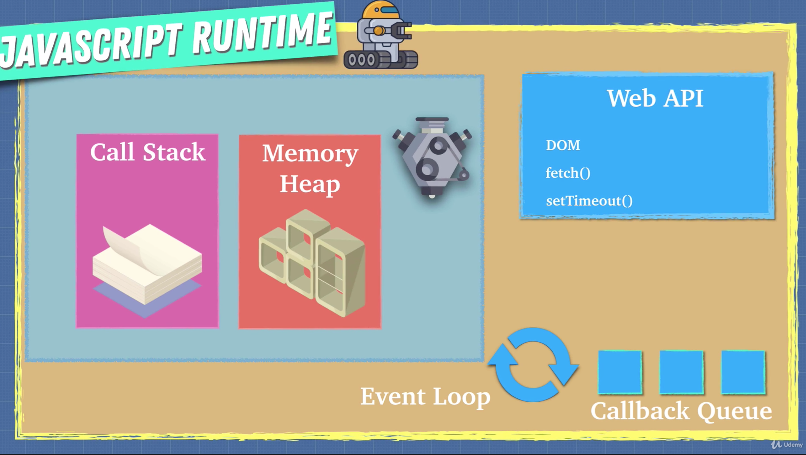
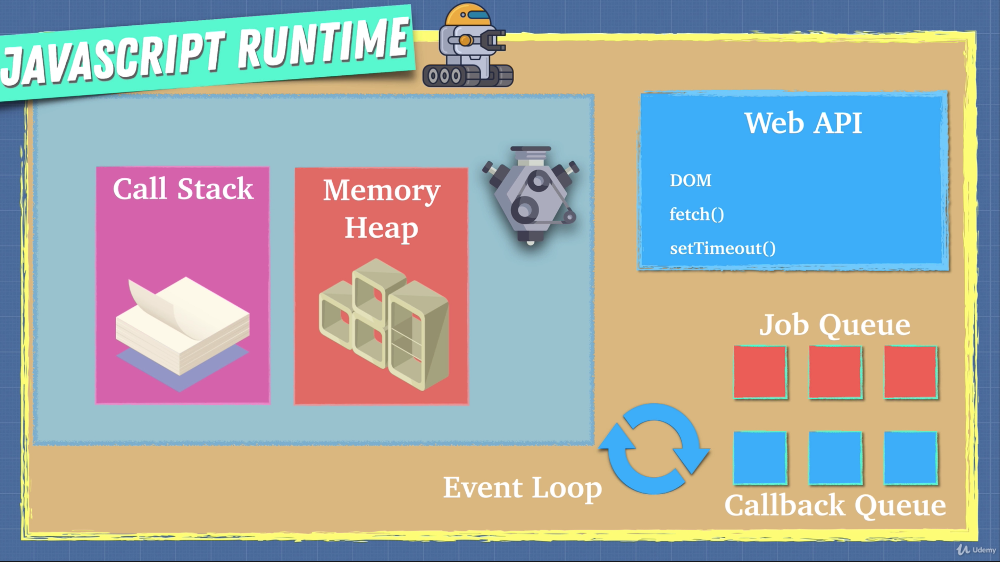

2019년 5월 25일

# Asynchronous javascript

---

> Javascript is a single threaded language that can be non-blocking

- 자바스크립트는 non-bloking이 가능한 싱글 쓰레드 언어이다.

- 싱글 쓰레드(Single Thread)

  - Only one thing at a time
  - 하나의 Call Stack을 갖고 있다.
  - 한번에 하나의 일만 처리할 수 있다.

## Javascript Runtime


  - Javascript Engine은 Single Thread로 한 번에 하나의 일만 처리한다.
  - 이를 보완하기위해 나온 게 Javascript Runtime이다.
  - Javascript Runtime에서는 비동기 처리가 가능하다.
  - Javascript Runtime은 `Javascript engine` +` Web API`, `Callback Queue`, `Event Loop`로 구성돼 있다.
    - `Web API`는 브라우저에서 제공되며 비동기로 동작한다.
      - `Web API`는 다양한 비동기 메소드를 제공한다.
        - 대표적으로 `setTimeout`이 있다.

### 자주 물어보는 Interview Question

```javascript
console.log('a');

setTimeout(() => {
	console.log('b')},2000)

console.log('c');

// a
// c
// b
```

- `setTimeout`의 `timer`를 `0`으로 바꿨을 때의 차이는?

```javascript
console.log('a');

setTimeout(() => {
	console.log('b')
},0)

console.log('c');

// a
// c
// b
```

- 결과는 똑같다.
- `timer`가 `0`이라하더라도` setTimeout`은 결국 `WebAPI`로 보내진다.
- 거기서 0초를 기다리고 `Callback Queue`로 가서 `Call Stack`이 비워질 때 까지 기다렸다가 `Call Stack`에 올라간다.
- 따라서 결과는 동일하다.


### 면접 단골 질문들

- 동기와 비동기 프로그램의 차이는 무엇일까?
- 자바스크립트는 어떻게 동작하나?


## Promise

> A promise is an object tha may produce a single value some time in the future

- 프로미스는 자바스크립트 비동기 처리에 사용되는 객체이다.

## Promise status

- 세 가지 중 하나의 상태값을 갖는다.
- 1. `pending`
- 2. `fullfilled`
- 3. `rejected`


### 콜백 지옥

```javascript
// callback pyramid of doom
movePlayer(100, 'Left', function () {
    movePlayer(400, 'Left', function () {
        movePlayer(10, 'Right',function () {
            movePlater(330, 'Left', function () {
            });
        });
    });
});
```

- `Promise`를 이용하면 다음과 같이 바뀐다.

```javascript
// Using promise
movePlayer(100, 'Left')
    .then(() => movePlayer(400,'Left'))
    .then(() => movePlayer(10, 'Right'))
    .then(() => movePlayer(330, 'Left'));
```


```javascript
const promise = new Promise((resolve, reject)=>{
    if(true) {
        resolve('It Works')
    } else {
        reject('Error..')
    }
});
```

```javascript
promise.then(result => console.log(result)); // It Works

promise
  .then(result => result + '!!')
	.then(result2 => console.log(result2)); // It Works!!
```

- 중간에 에러가 발생한다면?

```javascript
promise
  .then(result => result + '!!')
	.then(result2 => {
  			throw Error
        console.log(result2);
	}) // It Works!!
	.catch( () => console.log('ERROR..!')) // ERROR..!
```

```javascript
promise
  .then(result => result + '!!')
  .then(result2 => result2 + '??')
  .catch(() => console.log('ERRROR!'))
  .then(result3 => {
      console.log(result3 + '!!');
  });

	// It Works!!??!!
```

- catch 문 이전에 Error 가 발생하지 않으면 catch 문은 실행되지 않는다.


### Promise 는 비동기 프로그래밍을 할 때 매우 유용하다.


```javascript
const urls = [
    'https://jsonplaceholder.typicode.com/users',
    'https://jsonplaceholder.typicode.com/posts',
    'https://jsonplaceholder.typicode.com/albums',
];

Promise.all(urls.map(url =>{
    return fetch(url).then(resp=> resp.json())
})).then(result =>{
    console.log(result[0]);
    console.log(result[1]);
    console.log(result[2]);
}).catch(() => console.log('ERROR'));
```

## Async & Await

> Async function is a function that returns a promise

- Async & Await 를 사용하면 코드의 가독성이 높아진다.

#### Exercise 1

```javascript
// Using promise
movePlayer(100, 'Left')
    .then(() => movePlayer(400,'Left'))
    .then(() => movePlayer(10, 'Right'))
    .then(() => movePlayer(330, 'Left'));
```

- 위의 코드를 Async & Await를 사용해 바꿔보자

```javascript
// Async & Await
async function playerStart() {
    await movePlater(100, 'Left'); // pause
    await movePlayer(400,'Left'); // pause
    await movePlayer(10, 'Right'); // pause
    await movePlayer(330, 'Left'); // pause
}
```

- 내부적인 동작 방식은 promise를 사용할 때와 동일하다.


```javascript
async function playerStart() {
    const first = await movePlater(100, 'Left'); // pause
    const second = await movePlayer(400,'Left'); // pause
    const third = await movePlayer(10, 'Right'); // pause
    const firth = await movePlayer(330, 'Left'); // pause
}
```

- 위처럼  각각의 단계 마다 함수 리턴값을 변수에 할당할 수 있다.


#### Exercise 2

```javascript
fetch('https://jsonplaceholder.typicode.com/users')
    .then(response => response.json())
    .then( result => console.log(result));
```

- 위 코드는  Async & Await를 사용하면 아래와 같이 쓸 수 있다.

```javascript
// Async & Await
async function fetchUsers() {
    const response = await fetch('https://jsonplaceholder.typicode.com/users');
    const data = await response.json();
    console.log(data)
}
```

#### Exercise 3

```javascript
const urls = [
    'https://jsonplaceholder.typicode.com/users',
    'https://jsonplaceholder.typicode.com/posts',
    'https://jsonplaceholder.typicode.com/albums',
];

// using Promise
Promise.all(urls.map(url =>{
    return fetch(url).then(resp=> resp.json())
})).then(result =>{
    console.log('users', results[0]);
    console.log('posts', results[1]);
    console.log('albums', results[2]);
}).catch(() => console.log('ERROR'));
```


```javascript
// using Async & Await
const getData = async function () {
    try {
        const [users, posts, albums] = await Promise.all(urls.map(url => {
            return fetch(url).then(resp => resp.json())
        }));
        console.log('users', users);
        console.log('posts', posts);
        console.log('albums', albums);
    }catch (error) {
        console.log('oops!', error)
    }
};
```

- Promise.all에 담긴 결과값을 `users, posts, albums` 변수에 할당해 가져온다
- Promise보다 좀 더 직관적임을 알 수 있다.
- 에러 처리는 try, catch 문으로 감싸주면 된다.


#### 정리

- Promise와 Async & Await 의 내부 동작 방식은 동일하다.
- 어떠 것을 사용하냐는 개인 취향이다.
- 따라서 팀 또는 개인의 선호도에 따라 사용하면 될 것 같다. 


## Job Queue

- 보통 자바스크립트 런타임의 구조는 아래 그림과 같이 알고 있다.



- 하지만 ES6부터 자바스크립트 런타임에 `Job Queue`가 추가됐다.



- `Callback Queue` 와 더불어 `Job Queue` 가 있다.
- `Jab Queue` 는 `Callback Queue` 보다 더 높은 우선순위를 갖는다.
- 따라서 `Callback Queue` 에 있는 함수보다 늦게 실행 되었다 하더라도 `Job Queue`에 있는 함수가 먼저 실행 된다.
- 아래 예제를 보자

```javascript
// Callback Queue or Task Queue
setTimeout(()=> {console.log('1', 'first setTimeout callback')},0);
setTimeout(()=> {console.log('2', 'second setTimeout callback')},10);

// Job Queue or Microtask Queue
Promise.resolve('hi').then((data)=> console.log('3', data));

// function in global scope
console.log('4', 'function in global execution environment');

// 4 function in global execution environment
// 3 hi
// 1 first setTimeout callback
// 2 second setTimeout callback
```

- 실행 결과값은 4 - 3 - 1 - 2 순이다.

- setTimeout 과 Promise 모두 비동기로 동작하는 함수이다.

- 따라서 동기(synchronous)로 실행 되는 4 번 함수의 결과 값이 가장 먼저 나오는 것은 자연스럽다.

- 그런데 Promise 함수가 setTimeout 함수 보다 늦게 호출 되었음에도 결과값이 먼저 나왔다.

- 그 이유는 Promise 함수는 `Callback Queue` 가 아닌 `Job Queue`로 들어가기 때문이다.

- 자바스크립트 런타임의 동작 원리를 알면 위 예제의 결과값의 순서가 왜 저렇게 나오는지 이해 할 수 있다.

>  ES6 이후에 자바스크립트 런타임에 Job Queue가 추가되었다.
>
>  따라서 브라우저에 따라 Job Queue를 지원하지 않을 수 있다.

---

### Reference

- [Udemy: Advanced JavaScript Concepts by Andrei Neagoie](<https://www.udemy.com/advanced-javascript-concepts/>)
