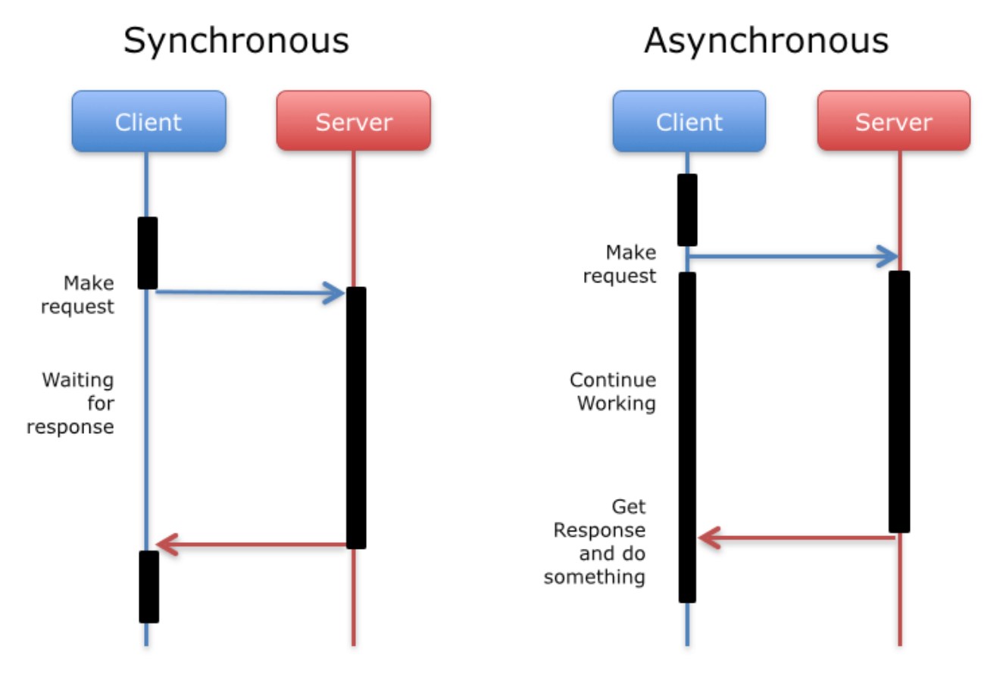

2019년 6월 3일

# Asynchronous Code

---

## 비동기(Asynchronous) 란?

- 비동기(asynchronous)란 동기(synchronous)와 달리 이전 테스크(task)가 종료 되기를 기다리지 않고 다음 테스크(task)를 진행하는 작업 방식을 말한다.



그림 출처 : https://www.smashingmagazine.com/2017/03/simplify-android-networking-volley-http-library/

- 비동기 코드 작성법에 대해 알아보자.

```javascript
console.log('Before');
const user = getUser(1);
console.log(user); // undefined
console.log('After');

function getUser(id){
    setTimeout(()=>{
        console.log('Reading a user from a database..');
        return {id: id, gitHubUserName: 'Sony'};
    }, 2000);
}
```

- 위 예제를 실행한 결과는 다음과 같다.

```bash
Before
undefined
After
```

- `user`는 `undefined` 가 뜬다.

- 그 이유는 `getUser` 함수가 실행하는 `setTimeout` 함수가 비동기 함수이기 때문이다.

- 위 예제에서 비동기 함수인 `setTimeout` 함수는 2초뒤에 실행 된다.

- 즉 `getUser` 함수가 실행되는 시점과 `setTimeout` 함수가 실행되는 시점이 다르다.

- 그러므로 변수 `user`에는 `setTimeout`의 리턴값이 할당되지 않는다.

- 어떻게 하면 비동기 함수를 제어할 수 있을까?

- 자바스크립트에서 비동기 코드를 작성하는 방법은 크게 세 가지가 있다.

- 다음 세 가지 방법을 이용하여 위 문제를 해결해보자.

## 비동기 코드를 작성하는 방법

1. `Callbacks`

2. `Promise`

3. `Async&await`

## Callbacks

```javascript
console.log('Before');
getUser(1, user => console.log(user));
console.log('After');

function getUser(id, callback){
    setTimeout(()=>{
        console.log('Reading a user from a database..');
        callback({id: id, gitHubUserName: 'Sony'});
    }, 2000);
}
```

- 위 코드를 보면 콜백 함수를 이용해서 비동기 처리를 했다.
- `getUser()`의 callback 함수는 `setTimeout()`의 콜백 함수 안에 들어있다.
- `setTimeout()`의 콜백 함수는 2초 뒤에 실행 되고 그 안에 있는 `getUser`의 callback 함수도 2초 뒤에 실행된다.
- 따라서 2초 뒤에 `user object`인 `{id: id, gitHubUserName: 'Sony'}` 값이 `user`에 할당된다.
- 위 코드를 실행한 결과는 다음과 같다.

```bash
Before
After
Reading a user from a database..
{ id: 1, gitHubUserName: 'Sony' }
```

- 위 예제는 특정 유저의 객체 (`user object`)를 가져오는 간단한 로직이다.
- 로직을 조금 더 추가해보자

## Callback Hell

```javascript
console.log('Before');
getUser(1, (user)=>{
    console.log('User', user);
    getRepositories(user.gitHubUserName, (repos) =>{
        console.log('Repos', repos);
        getCommits(repos, (commits)=>{
            console.log("Commits", commits);
        })
    })
})
console.log('After');

function getUser(id, callback) {
    setTimeout(() => {
        console.log('Reading a user from a database..');
        callback({id: id, gitHubUserName: 'Sony'});
    }, 2000);
}

function getRepositories(username, callback) {
    setTimeout(() => {
        console.log('Calling GitHub API..');
        callback(['repo1', 'repo2', 'repo3']);
    }, 2000)
}

function getCommits(repos, callback) {
    setTimeout(()=>{
        console.log('Here are the commits from ' + repos);
        callback("commit");
    }, 2000)
}
```

- 함수 `getRepositories()` 와 `getCommits()`이 추가되었다.
- 추가한 로직은 다음과 같다.

1. `getUser()` : 특정 **유저 객체**(`user object`)를 가져온다.
2. `getRepositories()` : 해당 유저의 깃허브 **레퍼지토리**를 가져온다.
3. `getCommits()` : 특정 깃허브 레퍼지토리의 **커밋**을 가져온다.

- 위의 코드를 단순화시켜서 보자

```javascript
console.log('Before');
getUser(1, (user)=>{
    getRepositories(user.gitHubUserName, (repos) =>{
        getCommits(repos, (commits)=>{
        })
    })
})
console.log('After');
```

- 세 개의 함수 `getUser()`, `getRepositories()`,`getCommits()`가 중첩된 구조이다.

- `getUser()`함수의 콜백이 `getRepositories()`함수를 호출하고 `getRepositories()`함수의 콜백이 `getCommits()`를 호출한다.

- 콜백이 콜백을 호출하는 구조이다.

- 위 예제에서는 설명을 위해 간단히 세 가지 콜백함수만 사용했지만 실제로 프로그램을 짤 때는 훨씬 더 많은 콜백이 필요하다.

- 따라서 코드는 더 복잡해지고 가독성이 낮아지는 문제가 발생한다.

- 이러한 문제를 콜백헬(callback hell)이라고 부른다.

- 어떻게 하면 콜백헬(callback hell)을 해결할 수 있을까?

### Callback Hell에서 벗어나기

- 익명 함수를 **named 함수**로 대체한다.

```javascript
console.log('Before');
getUser(1, (user)=>{
    getRepositories(user.gitHubUserName, (repos) =>{
        getCommits(repos, (commits)=>{
        })
    })
})
console.log('After');
```

- 위 코드에서 세 개의 함수 `getUser()`, `getRepositories()`,`getCommits()`는 두 번째 인자로 익명의 콜백 함수를 받는다.
- 익명의 콜백 함수를 이름 있는 **named 함수**로 대체해보자.

```javascript
console.log('Before');
getUser(1, gRepositories);
console.log('After');

function gRepositories(user) {
    getRepositories(user.gitHubUserName, gCommits);
}

function gCommits(repos) {
    getCommits(repos, displayCommits);
}

function displayCommits(commits) {
    console.log('Commits', commits);

}

function getUser(id, callback) {
    setTimeout(() => {
        console.log('Reading a user from a database..');
        callback({id: id, gitHubUserName: 'Sony'});
    }, 2000);
}

function getRepositories(username, callback) {
    setTimeout(() => {
        console.log('Calling GitHub API..');
        callback(['repo1', 'repo2', 'repo3']);
    }, 2000)
}

function getCommits(repo,callback) {
    setTimeout(()=>{
        console.log('Here are the commits from ' + repo);
        callback("commit");
    }, 2000)
}
```

- `getUser()`, `getRepositories()`,`getCommits()` 함수의 두 번째 인자인 익명의 콜백 함수를 **named 함수**로 대체했다.

```javascript
getUser(1, (user)=>{
    getRepositories(user.gitHubUserName, (repos) =>{
        getCommits(repos, (commits)=>{
        })
    })
})
```

- 위처럼 중첩된 콜백을 가진 기존 코드가 아래와 같이 변경되었다.

```javascript
getUser(1, gRepositories);
```

- 따라서 콜백 지옥(callback hell)에서 벗어났다.

- 하지만 필요한 함수가 늘어나 코드가 길어졌고 가독성 문제도 해결되지 않았다.

- `callback` 함수로 비동기 코드를 작성하는 것보다 더 좋은 방법은 
없을까?

- ES6부터 제공하는 `Promise`를 이용하면 된다.

- [다음장](./docs/nodejs/2019-06-05-nodejs-Promise.md)에서는 `Promise`에 대해 알아보자.

----

### Reference

-  [Udemy: Nodejs - The Complete Guide to Build RESTful APIs](https://www.udemy.com/nodejs-master-class/)