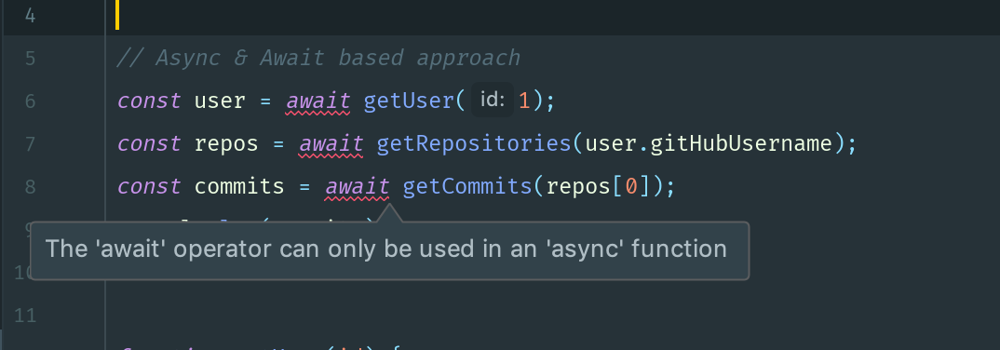

2019년 6월 7일

# Async & Await

---

## Asnyc & Await 이란

> Async & Await hepls you write asynchronous code like synchronous

- `Asnyc & Await`은 자바스크립트에서 **비동기 코드를 구현하는 방식** 중 하나이다.

- **내부적으로는 Promise 기반으로 동작**하는 비동기 코드이지만 **외부적으로는 동기 코드** 처럼 보이게 만들어 준다.

  - 비동기 코드를 **동기 코드처럼 보이게 해준다.**

  - 코드가 **간결**해지고 **가독성**이 높아진다.

```javascript
// Promise-based approach
getUser(1)
  .then(user => getRepositories(user.gitHubUsername))
  .then(repos => getCommits(repos[0]))
  .then(commits => console.log('Commits', commits))
  .catch(err => console.log('Error', err.message));
```

- 위 코드는 `Promise` 기반으로 작성한 비동기 코드이다.

- 위 코드를 `Async & Await`을 이용하여 작성해보자.

```javascript
// Async & Await based approach
const user = await getUser(1);
const repos = await getRepositories(user.gitHubUsername);
const commits = await getCommits(repos[0]);
console.log(commits);
```

- 각각의 변수에는 Promise 함수가 resolve 한 결과값이 담긴다.

    - `user` 에는 `getUser()`에서 resolve 한 값이 담긴다.
    - `repos` 에는 `getRopositories()`에서 resolve 한 값이 담긴다.
    - `commits` 에는 `getCommits()`에서 resolve 한 값이 담긴다.


## async & await keyword

### await을 사용하기 위해서는 async 키워드가 붙은 함수가 필요하다.

- 아래와 같이 `async` 키워드 함수안에서만 `await`을 사용할 수 있다.

```javascript
// Async & Await based approach
async function displayCommits() {
    const user = await getUser(1);
    const repos = await getRepositories(user.gitHubUsername);
    const commits = await getCommits(repos[0]);
    console.log(commits);
}

displayCommits();
```



## Syntactic sugar

### Async & Await are built on top of Promises

> It is an syntactic sugar that allow us to write asynchronous code like synchronous

- `Async & Await` 함수를 실행하면 내부적으로는 `Promise.then`을 체이닝(chaining)한 구조로 실행된다.

- 마치 Javascript에서 `class` 명령어를 사용해도 내부적으로는 `prototype` 형태로 객체를 생성하는 것과 비슷하다.

- 동기(synchronous) 코드처럼 보이지만 사실은 비동기로 작동하는 코드이다.

```javascript
const user = await getUser(1);
```

- 위 코드에서 await는 `getUser(1)` 함수가 종료될 때까지 계속 기다리지 않는다. (비동기 함수이므로) 다른 작업을 진행하면서 기다리다가 `getUser(1)` 함수가 종료되면 결과값을 `user`에 할당하고 다음 로직을 진행한다.

## try .. catch

- `Async & Await`에서 **에러 처리**를 하기 위해서는 `try..catch` 구문을 사용한다.

```javascript
// Async & Await based approach
async function displayCommits() {
    try {
        const user = await getUser(1);
        const repos = await getRepositories(user.gitHubUsername);
        const commits = await getCommits(repos[0]);
        console.log(commits);
    } catch (error) {
        console.log('Error', error.message);
    }
}

displayCommits();
```

### Exercise

- Callback 기반으로 작성된 비동기 코드를 `Async & Await`을 이용한 비동기 코드로 바꾸어보자.

```javascript
getCustomer(1, (customer) => {
  console.log('Customer: ', customer);
  if (customer.isGold) {
    getTopMovies((movies) => {
      console.log('Top movies: ', movies);
      sendEmail(customer.email, movies, () => {
        console.log('Email sent...')
      });
    });
  }
});

function getCustomer(id, callback) {
  setTimeout(() => {
    callback({
      id: 1,
      name: 'sony',
      isGold: true,
      email: 'email'
    });
  }, 4000);  
}

function getTopMovies(callback) {
  setTimeout(() => {
    callback(['movie1', 'movie2']);
  }, 4000);
}

function sendEmail(email, movies, callback) {
  setTimeout(() => {
    callback();
  }, 4000);
}
```

- 위 코드를 `Async & Await`으로 바꾸면 다음과 같다.

```javascript
// Async & Await based approach
async function notyfyCustomer() {
    try {
        const customer = await getCustomer(1);
        console.log('Customer: ', customer);
        if (customer.isGold) {
            const movies = await getTopMovies()
            console.log('Top movies: ', movies);
            await sendEmail(customer.email, movies);
            console.log('Email sent...')
        }
    } catch (e) {
        console.log('Error', e.message);
    }
}

function getCustomer(id) {
    return new Promise(resolve => {
        setTimeout(() => {
            resolve({
                id    : 1,
                name  : 'sony',
                isGold: true,
                email : 'email'
            });
        }, 4000);
    })
}

function getTopMovies() {
    return new Promise(resolve => {
        setTimeout(() => {
            resolve(['movie1', 'movie2']);
        }, 4000);
    })
}

function sendEmail(email, movies) {
    return new Promise(resolve => {
        setTimeout(() => {
            resolve();
        }, 4000);
    })
}
```

---

### Reference

-  [Udemy: Nodejs - The Complete Guide to Build RESTful APIs](https://www.udemy.com/nodejs-master-class/)