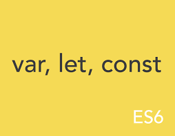

2019년 4월 10일

# var, let, const 와 Hoisting



## var

- ES5까지 변수를 선언할 수 있는 유일한 방법은 var 키워드를 사용하는 것이었다
- 하지만 var 변수는 아래와 같은 특징을 가져 심각한 문제를 일으킬 소지를 갖고 있다.

### 1. **함수 레벨 스코프(Function-level scope)**
- 전역 변수를 남발할 가능성을 높인다.
    - 함수의 코드 블록만을 스코프로 인정한다. 
    - 따라서 전역 함수 외부에서 생성한 변수는 모두 전역 변수이다.
    
- for 문의 변수 선언문에서 선언한 변수를 for 문의 코드 블록 외부에서 참조할 수 있다.

### 2. **var 키워드 생략 허용**
- 암묵적 전역 변수를 남발할 가능성이 크다.

### 3. **변수 중복 선언 허용**
- 의도치 않게 변수값이 변할 수 있다.

### 4. **변수 호이스팅**
- 변수를 선언하기 전에 참조한다.

- 대부분의 문제는 전역 변수로 인해 발생한다. 
- 변수의 스코프는 좁을수록 좋다.
- **이러한 var 키워드의 단점을 보완하기 위해 ES6부터 let과 const 키워드가 도입되었다.**

## 1. let

### 1.1 블록 레벨 스코프(Block-level scope)

- 대부분 프로그래밍 언어는 **블록 레벨 스코프(Block-level scope)** 를 따른다.
- 하지만 자바스크립트는 **함수 레벨 스코프(Function-level scope)** 를 따른다.

1. **함수 레벨 스코프(Function-level scope)**
- 함수 내에서 선언된 변수는 **함수 내에서만 유효**하며 함수 외부에서는 참조할 수 없다. 
- 함수 내부에서 선언한 변수는 지역 변수이며 **함수 외부에서 선언한 변수**는 **모두 전역 변수**이다.

2. **블록 레벨 스코프(Block-level scope)**
- 코드 블록(함수, if 문, for 문, while 문, try/catch 문 등) 내에서 선언된 변수는 **코드 블록 내에서만 유효**하며 코드 블록 외부에서는 참조할 수 없다
- **코드 블록 내부**에서 선언한 변수는 **지역 변수**이다.

```javascript
var foo = 123; // 전역 변수

console.log(foo); // 123

{
  var foo = 456; // 전역 변수
}

console.log(foo); // 456
```
- 자바스크립트는 블록 레벨 스코프(Block-level scope)를 따르지 않는다.
- 따라서 코드 블록 내의 `var foo`는 전역 변수이다.
- 이전에 이미 `var foo`가 선언 되었다.
- `var 키워드`는 중복을 허용하므로 오류는 나지 않고 새로운 값(`456`)으로 덮어쓴다.

- **ES6**에서 도입된 `let`, `const`를 이용해 **블록 레벨 스코프(Block-level scope)** 변수 선언이 가능하다.

```javascript
let foo = 123; // 전역 변수

{
  let foo = 456; // 지역 변수
  let bar = 456; // 지역 변수
}

console.log(foo); // 123
console.log(bar); // ReferenceError: bar is not defined
```
- let 키워드로 선언된 변수는 블록 레벨 스코프를 따른다.

## 1.2 변수 중복 선언 불가능

```javascript
var foo = 123;
var foo = 456;  // 중복 선언 허용

let bar = 123;
let bar = 456;  // Uncaught SyntaxError: Identifier 'bar' has already been declared
```
- `var 키워드`로는 동일한 이름을 갖는 변수를 중복해서 선언할 수 있었다.
- 하지만 `let 키워드`로는 동일한 이름을 갖는 변수를 중복해서 선언할 수 없다.


## 1.3 호이스팅(Hoisting)
> 호이스팅(Hoisting)이란, var 선언문이나 function 선언문 등을 해당 스코프의 선두로 옮긴 것처럼 동작하는 특성을 말한다.

- 자바스크립트는 **모든 선언문**(var, let, const, function, function, class)을 **호이스팅**한다.
- 즉, 선언되기 이전에 호이스팅하여 참조한다.

### 변수는 다음 3단계를 거쳐 생성된다.

1. **선언 단계(Declaration phase)**
- 변수를 실행 컨텍스트의 **변수 객체(Variable Object)** 에 **등록**한다. 이 변수 객체는 **스코프가 참조하는 대상**이 된다.
2. **초기화 단계(Initialization phase)**
- 변수 객체(Variable Object)에 등록된 **변수를 위한 공간**을 **메모리에 확보**한다. 이 단계에서 변수는 `undefined`로 **초기화**된다.
3. **할당 단계(Assignment phase)**
- `undefined`로 초기화된 변수에 **실제 값**을 **할당**한다.

#### var 키워드로 선언된 변수는 선언 단계와 초기화 단계가 한번에 이루어진다.

- `선언 + 초기화`
- 스코프에 변수를 등록(선언 단계)하고 메모리에 변수를 위한 공간을 확보한 후, undefined로 초기화(초기화 단계)한다. 
- 따라서 변수 선언문 이전에 변수에 접근하여도 스코프에 변수가 존재하기 때문에 에러가 발생하지 않고 undefined를 반환한다. 
- 이후 변수 할당문에 도달하면 비로소 값이 할당된다.


```javascript
// 스코프의 선두에서 선언 단계와 초기화 단계가 한꺼번에 실행된다.
// 따라서 변수 선언문 이전에 변수를 참조할 수 있다.
console.log(foo); // undefined

var foo; // 변수 선언문
console.log(foo); // undefined

foo = 1; // 할당문에서 할당 단계가 실행된다.
console.log(foo); // 1
```

#### let 키워드로 선언된 변수는 선언 단계와 초기화 단계가 분리되어 진행된다. 

- **스코프에 변수를 등록**(`선언단계`)하지만 초기화 단계는 변수 선언문에 도달했을 때 이루어진다. 
- 초기화 이전에 변수에 접근하려고 하면 참조 에러(ReferenceError)가 발생한다. 
- 이는 변수가 아직 초기화되지 않았기 때문이다. 즉, 변수를 위한 메모리 공간이 아직 확보되지 않았기 때문이다. 
- 따라서 **스코프의 시작 지점부터 초기화 시작 지점까지**는 변수를 참조할 수 없다. 
- 스코프의 시작 지점부터 초기화 시작 지점까지의 구간을 **‘일시적 사각지대(Temporal Dead Zone; TDZ)’** 라고 부른다.


```javascript
// 스코프의 선두에서 선언 단계가 실행된다.
// 아직 변수가 초기화(메모리 공간 확보와 undefined로 초기화)되지 않는다.
// 따라서 변수 선언문 이전에 변수를 참조할 수 없다.
console.log(foo); // ReferenceError: foo is not defined

let foo; // 변수 선언문에서 초기화 단계가 실행된다. (메모리 공간 확보 + undefined로 초기화) 
console.log(foo); // undefined

foo = 1; // 할당문에서 할당 단계가 실행된다.
console.log(foo); // 1
```

- 스코프(Scope) 내에서의 호이스팅

```javascript
let foo = 1; // 전역 변수

{
  console.log(foo); // ReferenceError: foo is not defined
  let foo = 2; // 지역 변수
}
```
- let으로 선언된 변수는 블록 레벨 스코프를 가지므로 코드 블록 내에서 선언된 변수 foo는 지역 변수이다.
- 지역변수 foo의 스코프는 해당 코드 블록이 된다.
- 지역 변수 foo도 해당 스코프에서 호이스팅되고 코드 블록의 선두부터 초기화가 이루어지는 지점까지 일시적 사각지대(TDZ)에 빠진다.
- 따라서 전역 변수 foo의 값이 출력되지 않고 참조 에러(ReferenceError)가 발생한다.

### 1.4 클로저(Closure)

> 공부 후 정리

### 1.5 전역 객체와 let

- **전역 객체(Global Object)** 는 모든 객체의 유일한 **최상위 객체**를 의미한다.
    - **Browser-side**: `window` 객체
    - **Server-side(Node.js)**: `global` 객체


- var 키워드로 선언된 변수를 전역 변수로 사용하면 전역 객체의 프로퍼티가 된다.

```javascript
var foo = 123; // 전역변수

console.log(window.foo); // 123
```

- let 키워드로 선언된 변수를 전역 변수로 사용하면 전역 객체의 프로퍼티가 아니다.
- let 전역 변수는 보이지 않는 개념적인 블록 내에 존재하게 된다.

```javascript
let foo = 123; // 전역변수

console.log(window.foo); // undefined
``` 

## const

> const는 상수(변하지 않는 값)를 위해 사용한다. 

> 하지만 반드시 상수만을 위해 사용하지는 않는다.

### 2.1 선언과 초기화

- let은 재할당이 자유로우나 const는 재할당이 불가능 하다.

```javascript
const FOO = 123;
FOO = 456; // TypeError: Assignment to constant variable.
```

- **const는 반드시 선언과 동시에 할당이 이루어져야 한다**

```javascript
const FOO; // SyntaxError: Missing initializer in const declaration
```

- const는 let과 마찬가지로 **블록 레벨 스코프**를 갖는다.

```javascript
{
  const FOO = 10;
  console.log(FOO); //10
}
console.log(FOO); // ReferenceError: FOO is not defined
```

### 2.2 상수

- 가독성과 유지보수의 편의를 위해 상수를 적극적으로 사용하자
- 적절한 네이밍으로 상수로 선언하면 가독성과 유지보수성이 대폭 향상된다.

```javascript
// 10의 의미를 알기 어렵기 때문에 가독성이 좋지 않다.
if (rows > 10) {
}

// 값의 의미를 명확히 기술하여 가독성이 향상되었다.
const MAXROWS = 10;
if (rows > MAXROWS) {
}
```

- const는 객체에도 사용할 수 있다. 하지만 이때도 재할당은 불가능하다.

```javascript
const obj = { foo: 123 };
obj = { bar: 456 }; // TypeError: Assignment to constant variable.
```

### 2.3 const와 객체

- const는 재할당이 금지된다. 
- 이는 const 변수의 타입이 객체인 경우, 객체에 대한 참조를 변경하지 못한다는 것을 의미한다. 
- **하지만** 이때 **객체의 프로퍼티**는 보호되지 않는다. 
- 즉, **재할당은 불가능**하지만 **할당된 객체의 내용**(프로퍼티의 추가, 삭제, 프로퍼티 값의 변경)은 **변경할 수 있다**.

```javascript
const user = { name: 'Lee' };

// const 변수는 재할당이 금지된다.
// user = {}; // TypeError: Assignment to constant variable.

// 객체의 내용은 변경할 수 있다.
user.name = 'Kim';

console.log(user); // { name: 'Kim' }
```

- 객체의 내용이 변경되더라도 객체 타입 변수에 할당된 주소값은 변경되지 않는다.
- 따라서 **객체 타입 변수 선언에는 const를 사용**하는 것이 좋다. 

> 만약에 명시적으로 객체 타입 변수의 주소값을 변경(재할당)하여야 한다면 let을 사용한다.

## 3. **var** vs **let** vs **const**

1. 기본적으로 const를 사용한다.
    - 변경이 없는 상수나 (재할당이 필요없는)객체 타입에는 const를 사용한다.

2. 재할당이 필요한 변수에는 let을 사용한다. (ex. for문 i 변수)

3. var 키워드는 되도록이면 사용하지 않는다.
